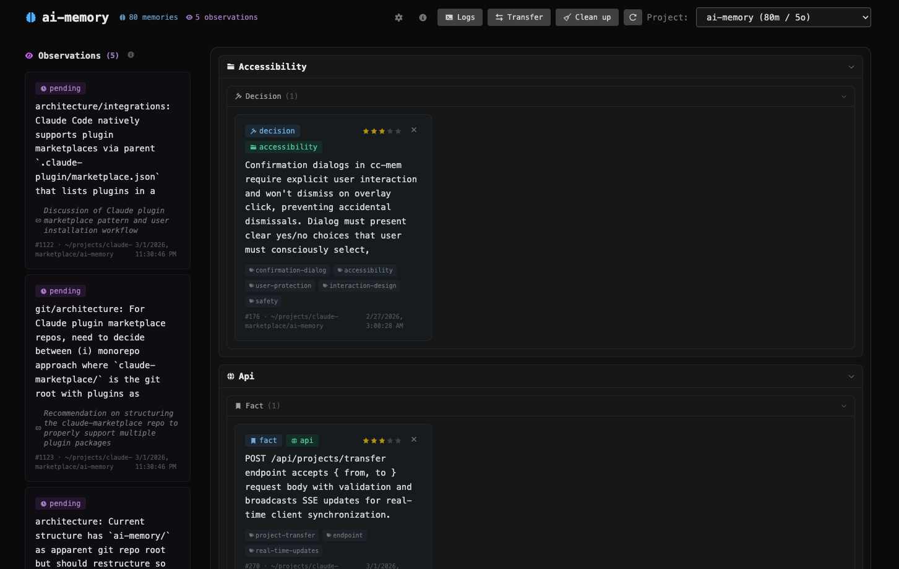
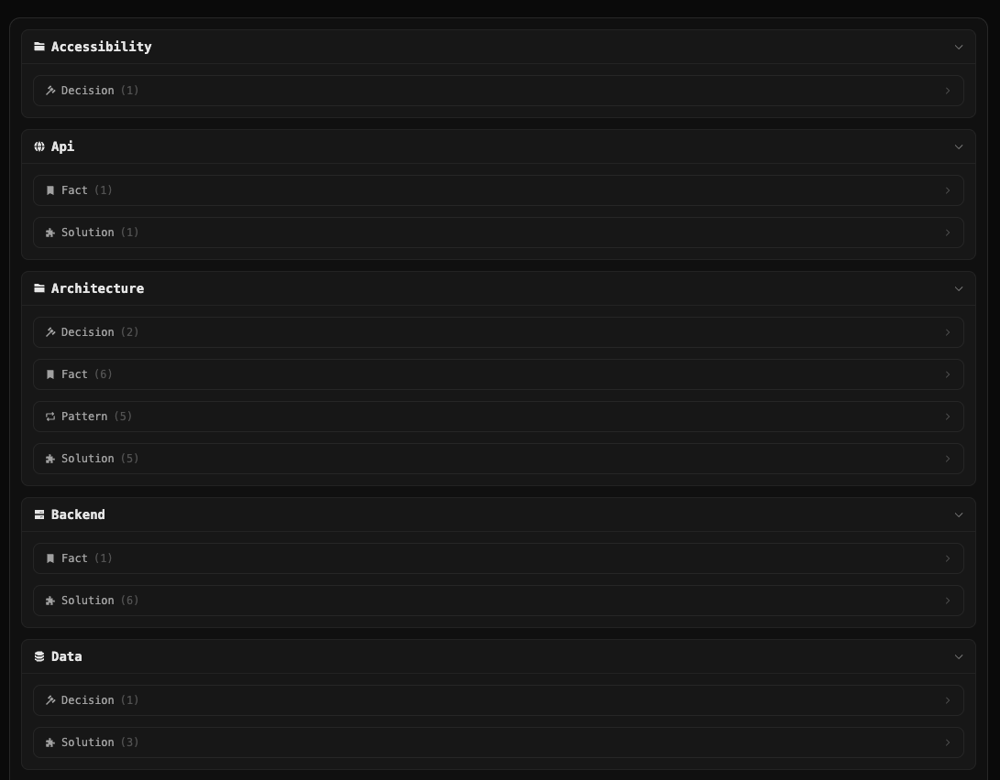
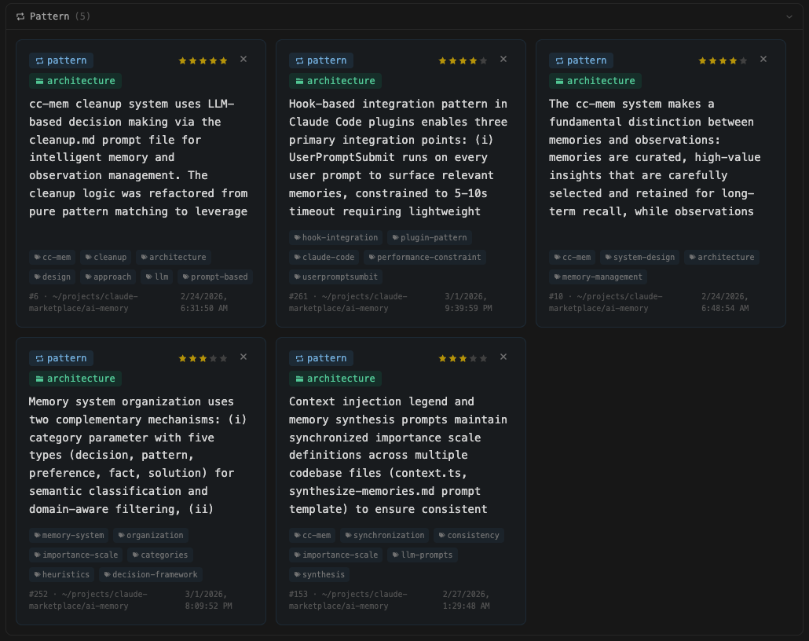
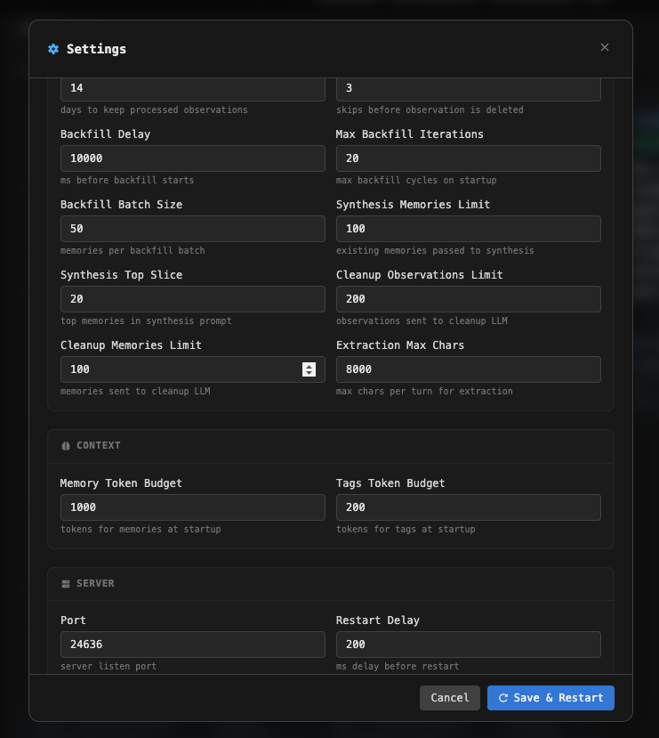
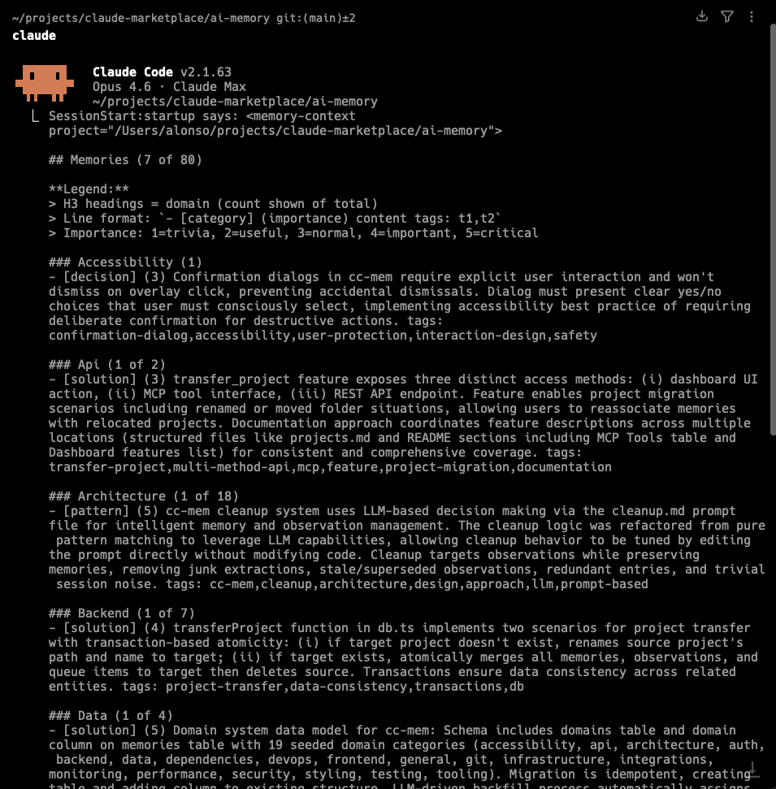

# ai-memory

Persistent memory for Claude Code. ai-memory automatically learns from your sessions and brings that context back in future ones — no manual note-taking required.

Everything runs locally. Your data never leaves your machine.

One server process handles everything — HTTP API, MCP tools, background worker, and dashboard. Unlike stdio-based MCP servers that spawn a new process per session, ai-memory starts a single instance on first use and reuses it across all your Claude Code sessions. If it's already running, the startup hook detects it and skips straight to fetching your context. This means no duplicated processes, no growing memory footprint, and no wasted CPU when you have multiple projects open.


## Prerequisites

- **Node.js 22+** — required for the server runtime
- **pnpm** — package manager (`npm install -g pnpm`)
- **sqlite3** with **FTS5 support** — required for full-text search indexes (most system SQLite installs include FTS5)

On first session start, ai-memory automatically installs dependencies and builds the server and dashboard. No manual setup is needed beyond having the prerequisites installed.


## Platform Support

| Platform | Status |
| -------- | ------ |
| **macOS** | Tested. Primary development platform. |
| **Linux** | High confidence. Uses standard Node.js and SQLite — should work out of the box. |
| **Windows (WSL)** | Likely works. The bash hooks and Unix conventions should function normally under WSL. |
| **Windows (native)** | Not supported. Hooks rely on bash scripts and Unix process management. |


## What It Does

When you end a Claude Code session, ai-memory captures observations — atomic facts, decisions, patterns, and preferences — from your conversation. A background worker periodically synthesizes those observations into memories: concise, categorized, domain-tagged summaries of what matters about your project.

When your next session starts, ai-memory injects a curated selection of those memories into the system prompt so Claude already knows your project's conventions, past decisions, and technical context.


## What To Expect

**First session:** ai-memory starts its local server and has no memories yet. You'll see a note that no memories exist for the project.

**After a few sessions:** Observations accumulate. Once 10 unprocessed observations exist for a project, synthesis runs automatically and produces memories.

**Ongoing:** Each session starts with a summary like:

```
## Memories (8 of 14)

### Frontend (2 of 5)
- [decision] (4) React Router v6 adopted for client routing tags: routing,react
- [pattern] (3) CSS modules for component-scoped styles tags: css,components

### Backend (3)
- [fact] (5) PostgreSQL 14 with alembic migrations tags: database,postgres
...
```

The injected context fits within ~1,000 tokens. Each domain gets at least its most important memory, then the remaining budget fills by importance across all domains. A legend explains the format, and if not all memories fit, a tip encourages Claude to use `search_memories` for deeper context.


## Data Storage

All state lives in `~/.ai-memory/`:

| File            | Purpose                                                                                   |
| --------------- | ----------------------------------------------------------------------------------------- |
| `memory.db`     | SQLite database (WAL mode) with all observations, memories, queues, and full-text indexes |
| `server.log`    | Server and worker logs                                                                    |
| `ai-memory.pid` | PID file for the running server process                                                   |

No cloud services, no external APIs for storage. The only network calls are to the Anthropic API (via Claude Agent SDK) for observation extraction, memory synthesis, and cleanup — the same API your Claude Code session already uses.


## Concepts

### Observations

Raw facts extracted from your conversations. Each observation is a single atomic piece of information with a source summary noting where it came from. Observations are the input to synthesis — they accumulate until there are enough to process.

### Memories

Synthesized, categorized summaries derived from observations. Each memory has:

- **Content** — 1-3 sentence summary
- **Category** — what kind of knowledge it represents:

| Category     | Meaning                                            |
| ------------ | -------------------------------------------------- |
| `decision`   | A choice made between options, with rationale      |
| `pattern`    | A recurring approach established for the codebase  |
| `preference` | A user style or workflow preference                |
| `fact`       | A discovered truth about the system or environment |
| `solution`   | A working fix for a non-obvious problem            |

- **Importance** — 1 to 5 scale:
  - 1 = trivia
  - 2 = useful context
  - 3 = normal (default)
  - 4 = important — confusion if forgotten
  - 5 = critical — bugs or hours wasted if forgotten
- **Domain** — which area of development the memory belongs to (see [Domains](#domains))
- **Tags** — freeform labels for searchability (e.g., `routing`, `postgres`, `auth`)

### Domains

Every memory is assigned to exactly one domain. This controls how memories are grouped in session context and helps with search. There are 19 predefined domains:

`frontend` `styling` `backend` `api` `data` `auth` `testing` `performance` `security` `accessibility` `infrastructure` `devops` `monitoring` `tooling` `git` `dependencies` `architecture` `integrations` `general`

### Projects

Memories are scoped to the project directory where they were created. There's also a special `_global` project for cross-project knowledge. Queries always include both the current project's memories and global ones.

**Renamed or moved a project folder?** Use the Transfer button in the dashboard, the `transfer_project` MCP tool, or `POST /api/projects/transfer` to move all memories and observations to the new path. If the new path doesn't exist yet, the project is renamed in place. If it already exists, memories are merged into the target project.


## Commands

### `/remember [text]`

Manually save a memory. If you provide text, it becomes the memory content. Claude will ask you for category, tags, and importance. Suggests existing tags to keep vocabulary consistent.

### `/forget [search term]`

Find and delete memories. Optionally provide a search term to filter. Presents results and asks which to delete.


## MCP Tools

These tools are available to Claude during your session:

| Tool                  | What it does                                                         |
| --------------------- | -------------------------------------------------------------------- |
| `save_memory`         | Create a memory with content, category, importance, tags, and domain |
| `search_memories`     | Full-text search across memories                                     |
| `search_observations` | Full-text search across observations                                 |
| `list_memories`       | Browse memories with optional filters (tag, category, domain)        |
| `delete_memory`       | Remove a memory by ID                                                |
| `list_tags`           | See all tags and how many memories use each                          |
| `list_domains`        | See all domains and their memory counts                              |
| `list_projects`       | See all tracked projects                                             |
| `transfer_project`    | Move memories and observations from one project path to another      |

### Full-Text Search

Search uses SQLite FTS5. Supported syntax:

- `"exact phrase"` — match an exact phrase
- `term*` — prefix matching (e.g., `react*` matches `react`, `reactive`, `reactivity`)
- `term1 OR term2` — match either term
- `term1 AND term2` — match both terms
- `NOT term` — exclude a term


## How It Works

### Session Lifecycle

1. **Session starts** — the `SessionStart` hook ensures the ai-memory server is running (starts it if not), then fetches the memory context for the current project and injects it as a system message.

2. **You work** — Claude has your project context from previous sessions. You can also use `/remember`, `/forget`, or the MCP tools directly. Two hooks run transparently during your session:
   - **Per-prompt recall** (`UserPromptSubmit`) — on every message you send, ai-memory searches for memories relevant to your prompt and injects them as additional context. This means Claude surfaces the right memories at the right time, not just at session start.
   - **Duplicate detection** (`PreToolUse` on `save_memory`) — before saving a new memory, ai-memory checks for similar existing memories and warns Claude if duplicates exist.

3. **Session ends** — the `Stop` and `SessionEnd` hooks send the conversation to the server's `/enqueue` endpoint for async processing.

### Background Worker

A worker polls every 5 seconds:

1. **Observation extraction** — Dequeues conversation payloads, sends them to Claude Haiku to extract atomic observations.
2. **Memory synthesis** — When 10+ unprocessed observations accumulate for a project, synthesizes them into new or updated memories using Claude Haiku.
3. **Cleanup** — After synthesis, runs an LLM-based cleanup pass that removes junk observations (git noise, build output) and redundant or superseded memories.
4. **TTL purge** — Deletes processed observations older than 14 days. Their value has already been absorbed into memories.
5. **Strike counter** — Observations that get fed to synthesis but repeatedly ignored get a strike. After 3 strikes (3 synthesis runs where the observation was available but unused), the observation is auto-deleted.

### Context Injection Budget

At session start, ai-memory builds a memory summary within a ~1,000 token budget (~4,000 characters):

- **Phase 1:** Each domain gets its single most important memory (guarantees diversity).
- **Phase 2:** Remaining budget fills by importance across all domains.
- **Tags section:** Up to ~200 tokens of tag vocabulary with usage counts.
- **Search tip:** If not all memories fit, a note encourages using `search_memories` for domain-specific deep dives.

## Dashboard

A web UI is available at `http://localhost:24636` (or whatever port is configured). The default port 24636 spells **AIMEM** on a phone keypad. It shows:

- Memory cards with category, domain, importance, tags, and content
- Observation cards with processing status (pending/synthesized)
- Project selector with inline delete buttons to filter by project
- Settings modal to configure worker, context, server, and API parameters
- Domain and category management with add, edit, delete, and AI-assisted generation
- Restore defaults to recover any deleted built-in domains or categories
- Manual cleanup button
- Project transfer/migration tool
- Server logs viewer

The dashboard updates in real-time via server-sent events.


### Dashboard Screenshots










### CLI Screenshot




## Configuration

All configuration lives in `~/.ai-memory/config.yaml`. Every field has a sensible default — the file doesn't need to exist for ai-memory to work. You can also edit settings from the dashboard's gear icon, which writes the file and restarts the server.

Example:

```yaml
server:
    port: 24636
    restartDelayMs: 200

worker:
    pollIntervalMs: 5000
    observationThreshold: 10
    observationRetentionDays: 14
    observationSkipLimit: 3
    extractionLimit: 5
    synthesisLimit: 50
    cleanupLimit: 100

context:
    memoryTokenBudget: 1000
    tagTokenBudget: 200

api:
    defaultLimit: 50
    logsDefaultLines: 500
```

**Port changes and MCP:** When you change `server.port`, the startup hook automatically rewrites `.mcp.json` in both the plugin root and Claude's plugin cache (`~/.claude/plugins/cache/*/ai-memory/`) with the new port. This ensures MCP tools reconnect to the correct address without manual intervention.

No environment variables are needed. The plugin auto-starts the server on first session and manages its lifecycle.


## Development

```
pnpm install
pnpm build          # Build server + UI
pnpm dev            # Watch mode (server only)
pnpm dev:ui         # Vite dev server for UI
pnpm vitest run test/ # Run tests
```

### Project Structure

```
src/
  app.ts          — Hono server, API routes, SSE events, dashboard serving
  db.ts           — SQLite schema, migrations, queries
  worker.ts       — Background worker (extraction, synthesis, cleanup)
  context.ts      — Session context builder (memory injection)
  tools.ts        — MCP tool schemas
  sse.ts          — Server-sent events for real-time UI updates
  server.ts       — Entry point
  prompts/        — LLM prompt templates
  ui/             — SolidJS dashboard source
hooks/
  hooks.json      — Hook configuration (SessionStart, Stop, UserPromptSubmit, PreToolUse, SessionEnd)
  scripts/        — Shell scripts for hooks
commands/         — Slash command definitions (/remember, /forget)
skills/           — Skill definitions (memory-management)
dist/             — Built output
test/             — Test files
```

### Database Schema

The SQLite database (`~/.ai-memory/memory.db`) contains:

- `projects` — tracked project paths
- `observations` — extracted facts with `processed` flag and `skipped_count` strike counter
- `memories` — synthesized memories with category, importance, domain, tags
- `observation_queue` / `memory_queue` — async processing queues
- `domains` — the 19 predefined domain definitions
- `observations_fts` / `memories_fts` — FTS5 full-text search indexes with auto-sync triggers
